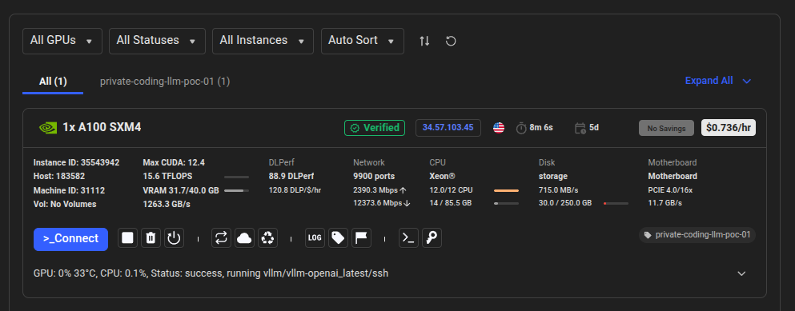
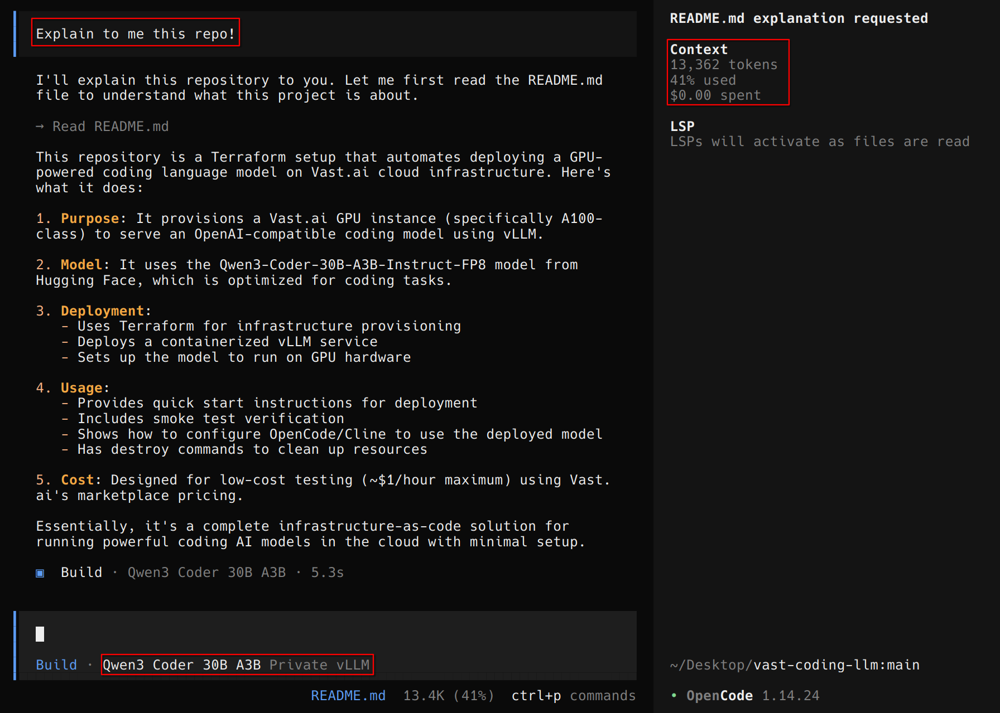

# Vast Coding LLM

Terraform setup for renting a Vast.ai GPU instance and serving an OpenAI-compatible coding model with vLLM.

Default model:

`Qwen/Qwen3-Coder-30B-A3B-Instruct-FP8`

Model link: https://huggingface.co/Qwen/Qwen3-Coder-30B-A3B-Instruct-FP8

This profile is good for cheap OpenCode/Cline-style testing and usually runs on one A100-class GPU.

## Runtime

- GPU: `A100 SXM4` or compatible A100/H100/H200 offer under the price cap
- Container image: `vllm/vllm-openai:latest`
- Served model name: `qwen3-coder-30b-a3b-instruct`

## Deployment Preview


_Caption: NVIDIA A100 SXM4 GPU used for the low-cost vLLM coding model deployment._



_Caption: Vast.ai running instance serving the Qwen3 Coder model through vLLM._



_Caption: OpenCode using the deployed Qwen3 Coder model to read and explain this repository._

## vLLM Logs

Full logs: [docs/runtime/vllm-startup.log](docs/runtime/vllm-startup.log)

```text
Starting vLLM for Qwen/Qwen3-Coder-30B-A3B-Instruct-FP8
(APIServer pid=428) INFO 04-24 20:01:41 [utils.py:299]  model   Qwen/Qwen3-Coder-30B-A3B-Instruct-FP8
(APIServer pid=428) INFO 04-24 20:01:50 [model.py:549] Resolved architecture: Qwen3MoeForCausalLM
(APIServer pid=428) INFO 04-24 20:01:50 [model.py:1678] Using max model len 32768
(EngineCore pid=512) INFO 04-24 20:02:58 [weight_utils.py:581] Time spent downloading weights for Qwen/Qwen3-Coder-30B-A3B-Instruct-FP8: 51.997631 seconds
(EngineCore pid=512) INFO 04-24 20:03:39 [default_loader.py:384] Loading weights took 40.65 seconds
(EngineCore pid=512) INFO 04-24 20:03:41 [gpu_model_runner.py:4820] Model loading took 29.54 GiB memory and 96.210335 seconds
(APIServer pid=428) INFO 04-24 20:04:59 [api_server.py:596] Starting vLLM server on http://0.0.0.0:8000
```

## Quick Start

Create `.env`:

```bash
export VAST_API_KEY="..."
export TF_VAR_inference_api_key="change-this"
```

Deploy:

```bash
source .env
terraform init
terraform apply \
  -var selected_model_profile=qwen3_coder_30b_fp8 \
  -var enable_provisioning=true \
  -var secure_datacenter_only=false \
  -var max_dollars_per_hour=1 \
  -var replica_count_override=1
```

Find the endpoint:

```bash
source .env
curl -fsS https://console.vast.ai/api/v0/instances/ \
  -H "Authorization: Bearer $VAST_API_KEY" |
  jq '.instances[] | {id,label,actual_status,public_ipaddr,ports,dph_total}'
```

Use the mapped host port for container port `8000`:

`http://PUBLIC_IP:HOST_PORT/v1`

## Change Model

Model profiles are defined in `locals.tf`. Change `selected_model_profile` to use another model.

```bash
terraform apply \
  -var selected_model_profile=qwen3_coder_30b_fp8 \
  -var enable_provisioning=true \
  -var secure_datacenter_only=false \
  -var max_dollars_per_hour=1 \
  -var replica_count_override=1
```

For larger models, increase `max_dollars_per_hour` and `disk_gb`.

## Check GPU Offers

Use the Vast.ai console to compare live GPU prices before changing Terraform:

- GPU search: https://cloud.vast.ai/create/
- Filter for `A100`, `H100`, or `H200`
- Prefer verified/datacenter offers when possible
- Check VRAM, disk space, reliability, country, and total dollars per hour
- Keep the selected offer under `max_dollars_per_hour`

For this model, start with one `A100 SXM4` around `$1/hr` or less. If no good offer is available, wait or raise the price cap slightly.

Terraform will still choose the actual instance using the filters in `variables.tf` and `locals.tf`.

## Smoke Test

Optional sanity check:

```bash
python3 scripts/smoke_test.py \
  --base-url "http://PUBLIC_IP:HOST_PORT/v1" \
  --api-key "$TF_VAR_inference_api_key" \
  --model "qwen3-coder-30b-a3b-instruct"
```

## OpenCode

Set `~/.config/opencode/opencode.jsonc` to point at the endpoint:

```jsonc
{
  "$schema": "https://opencode.ai/config.json",
  "model": "vast-vllm/qwen3-coder-30b-a3b-instruct",
  "provider": {
    "vast-vllm": {
      "npm": "@ai-sdk/openai-compatible",
      "name": "Private vLLM",
      "options": {
        "baseURL": "http://PUBLIC_IP:HOST_PORT/v1"
      },
      "models": {
        "qwen3-coder-30b-a3b-instruct": {
          "name": "Qwen3 Coder 30B A3B",
          "limit": {
            "context": 32768,
            "output": 4096
          }
        }
      }
    }
  }
}
```

Then run from any repo:

```bash
opencode -m vast-vllm/qwen3-coder-30b-a3b-instruct
```

## Destroy

Destroy the running instance when done:

```bash
source .env
terraform destroy \
  -var selected_model_profile=qwen3_coder_30b_fp8 \
  -var enable_provisioning=true \
  -var secure_datacenter_only=false \
  -var max_dollars_per_hour=1 \
  -var replica_count_override=1
```
