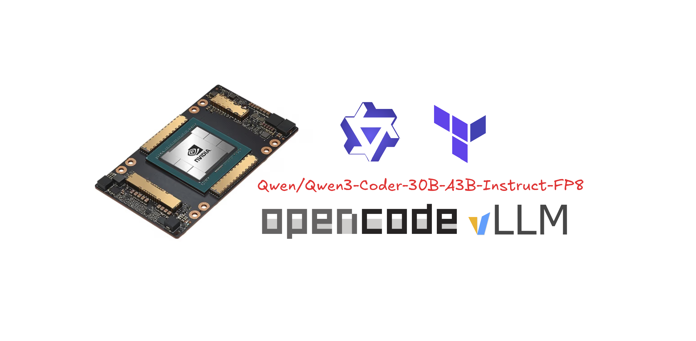

<p align="center">
  
</p>

# private-ai-inference

A Terraform + bash runner that rents a **Vast.ai** GPU box that already has
**Ollama** on it, pulls the models you choose (or delegates that to a repo you
supply), and wires it back to your CPU VM over an SSH tunnel — so the box
becomes the swappable GPU inference backend for the
[Local LLM Hub](./README1.md) CPU VM.

By default it rents the **cheapest offer that has an Ollama template**
(Vast.ai's official prebuilt Ollama image, found via `/api/v0/template/`) rather
than installing Ollama from scratch — faster boot, and it matches the "find a
box that already has an Ollama container" intent. You can reuse an existing
instance first (it queries `/api/v0/instances/`), and only rents if none is
available. Set `use_ollama_template = false` for the legacy bare-CUDA-image +
onstart-install path.

The thesis, inherited from the Local LLM Hub: **the GPU box does one thing** —
serve Ollama on `127.0.0.1:11434`, pull models (`ollama signin` for `:cloud`),
and own no policy and no tunnel. The CPU VM owns the tunnel and reaches the box
exactly the way the Hub already expects: `OLLAMA_BASE_URL=http://127.0.0.1:11434`
(or `http://host.docker.internal:11434` in a container) → SSH tunnel → Ollama
on the box. **No app-side change required.** Even in template mode we override
`OLLAMA_HOST` to loopback so Ollama is never published to the public internet.

This is the Vast.ai implementation of the Hub's swappable-GPU role (README1.md
names Vast.ai as the example host). Swap the box by re-running the deploy.

## How it sizes

You pick which fleet models to co-host (the list comes from the Hub fleet —
see `locals.tf` `model_catalog`). Provisioning is then:

- **min VRAM = 1.25 × the weight GB of the largest selected *local* model**
  (25% headroom for KV cache + activation). `:cloud` models are excluded from
  sizing — they're served from Ollama cloud with ~0 local VRAM.
- **SSD = 200 GB** and **RAM = 150 GB**, fixed.
- A `min_vram_floor_gb` (default 16) keeps a cloud-only selection honest so it
  still rents a real GPU box.

The fleet catalog (`locals.tf`) is the alignment seam between this provisioner
and the Hub app: add/remove a model here + pull it on the box, no app code
change (the Hub's "nothing static" rule for the GPU box).

```
CPU VM (this repo cloned here)               Vast.ai GPU box (provisioned)
  scripts/deploy.sh                              official Ollama template
    0. reuse an existing instance if one            (Ollama preinstalled; we
       is running, else rent the cheapest            override OLLAMA_HOST →
       offer that has an Ollama template             127.0.0.1:11434 loopback)
    1. select models                              onstart: ollama serve loopback,
    2. size VRAM = 1.25x largest local             ollama pull <local models>
    3. provision                                   (or defer to your model repo)
  4. (optional) deploy-model-repo.sh            :cloud → "ollama signin" once
  5. ssh poll until /api/tags lists models
  6. setup-tunnel.sh <ip> <sshport> <key>            │
    autossh -L 0.0.0.0:11434:127.0.0.1:11434 ───────▶│  Ollama 127.0.0.1:11434
  7. test: curl http://127.0.0.1:11434/api/tags     (loopback only, never public)
```

## Prerequisites (on the CPU VM)

- `terraform` ≥ 1.5
- `jq`, `curl`
- `autossh` — `sudo apt install autossh` (Linux) or `brew install autossh` (macOS)
- a Vast.ai API key + an SSH key registered with Vast.ai (`ssh_direct` access)

```bash
cp .env.example .env
# edit .env: VAST_API_KEY, PRIVATE_AI_SSH_KEY (path to your Vast SSH key)
```

## Quick start (end-to-end)

```bash
source .env
scripts/deploy.sh                       # interactive model pick + full flow
# or non-interactive:
scripts/deploy.sh --models qwen3_6_35b,gemma3_27b,nomic_embed --ssh-key ~/.ssh/vast_ed25519
# reuse a running instance if one exists, else rent (the "query first" flow):
scripts/deploy.sh --prefer-existing
# connect a specific existing instance by id (no rent):
scripts/deploy.sh --reuse-instance 44255872
# delegate model loading to your own GPU gateway repo (it "downloads the
# models, runs install.sh"):
scripts/deploy.sh --model-repo https://github.com/DurangoDavid/private-ai-gpu.git \
                  --model-repo-cmd './install.sh' \
                  --model-repo-key ~/.ssh/private-ai-gpu_deploy_ed25519
```

`deploy.sh` runs the full flow: (0) reuse an existing instance if `--prefer-existing`
/`--reuse-instance` is given → (1) select + size → (2) `terraform apply` (rents
the cheapest Ollama-template offer by default) → (3) wait for `running` +
Ollama up → (4b) deploy your model repo if `--model-repo` is given → (5) wait
for the selected local models in `/api/tags` → (6) stand up the SSH tunnel →
(7) test through it (`/api/tags` + `/api/generate`). On success it prints the
`OLLAMA_BASE_URL` to point the Hub CPU VM at.

Then on the Hub CPU VM (or same box), set:

```bash
OLLAMA_BASE_URL=http://127.0.0.1:11434           # bare metal
# or, in a container:
OLLAMA_BASE_URL=http://host.docker.internal:11434
```

## Cloud models (`:cloud`)

`ollama signin` is an interactive device-code approval, so it can't run
unattended in the Vast `onstart`. When you select any `:cloud` model:

- local models still pull and serve immediately on boot;
- `deploy.sh` prints a reminder to SSH in once and run `ollama signin`, then
  `ollama pull <cloud-model>` for each. This mirrors the Hub's "approve once"
  model — a one-time manual step, not automation.

## Pull the GPU gateway repo onto the box (optional)

Instead of pulling the selected fleet models in the onstart, you can point
`deploy.sh --model-repo <url>` at a repo that does the model loading itself
(e.g. `private-ai-gpu`, which runs `install.sh`). When set, the onstart serves
Ollama empty and `scripts/deploy-model-repo.sh` clones your repo onto the box
after boot and runs `--model-repo-cmd` (default `./install.sh`).

If that repo is **private** (it is), the box needs auth to clone it. You do
**not** need a per-box key — use one GitHub **deploy key** (read-only,
repo-scoped), authorized once and reused on every box. The private key is
shipped to the box at runtime over SSH and **must never be committed** to this
open-source repo.

```bash
# 1. Generate a read-only deploy keypair (no passphrase, so the unattended
#    clone works). Prints the public half to paste into GitHub.
scripts/new-deploy-key.sh ~/.ssh/private-ai-gpu_deploy_ed25519

# 2. Add the PRINTED PUBLIC key to the GPU repo:
#    github.com/DurangoDavid/private-ai-gpu → Settings → Deploy keys
#    Leave "Allow write access" OFF (read-only).

# 3. Put the private key path (NOT the key) in .env (already gitignored):
#    export PRIVATE_AI_GPU_REPO="https://github.com/DurangoDavid/private-ai-gpu.git"
#    export PRIVATE_AI_GPU_REPO_CMD="./install.sh"
#    export PRIVATE_AI_GPU_DEPLOY_KEY="$HOME/.ssh/private-ai-gpu_deploy_ed25519"

# 4. Run. deploy.sh normalizes the HTTPS URL to git@github.com for the deploy
#    key, ships the private key to the box, clones, and runs install.sh.
source .env
scripts/deploy.sh --prefer-existing --ssh-key ~/.ssh/vast_ed25519
```

If your GPU repo is (or can be made) **public**, skip all of this — drop
`PRIVATE_AI_GPU_DEPLOY_KEY` and `deploy-model-repo.sh` clones over HTTPS with
no auth.

> **Never commit a private key.** A deploy key in a public repo is immediately
> compromised and grants read access to your private repo. Keep it in a
> gitignored local file (the repo's `.gitignore` already excludes
> `*_deploy_ed25519`); only the path goes in `.env`.

## Direct Terraform use (no orchestrator)

```bash
source .env
terraform init
terraform apply \
  -var selected_models='["qwen3_6_35b","gemma3_27b","nomic_embed"]' \
  -var enable_provisioning=true \
  -var use_ollama_template=true \
  -var disk_gb=200 -var ram_gb=150
```

Inspect the rendered payloads without spending (no instance rented):

```bash
terraform apply -var enable_provisioning=false
# then look at .terraform-poc-state/private-ai-inference-render-only/
#   search_payload.json  (cpu_ram>=150, disk_space>=200, gpu_ram>=min_vram, gpu_name in union)
#   create_payload.json  (template mode: env.OLLAMA_HOST=127.0.0.1:11434 + onstart; no image)
#   onstart-ollama.sh    (ollama serve loopback, the ollama pull lines / model-repo deferral, cloud-signin note)
```

Connectivity (IP + SSH host port) is surfaced by `scripts/vast_instance_info.sh`
(it polls the Vast API until `running`), not a Terraform output, to avoid the
provisioner/data-source race on first apply.

## Reuse an existing Vast.ai instance (dormant/active server)

If you already have a Vast.ai server with Ollama on it (or want to reconnect to
a dormant one), you don't need to rent — query the API for your instances and
connect the tunnel to one. `deploy.sh` does this directly, or use the lower-level
`list-instances.sh`:

```bash
source .env
scripts/deploy.sh --prefer-existing             # reuse a running instance if one exists, else rent
scripts/deploy.sh --reuse-instance 44255872     # connect a specific instance by id (no rent)
scripts/list-instances.sh                       # list all instances, then pick one to connect
scripts/list-instances.sh --list-only           # just list, don't connect
scripts/list-instances.sh --connect 44255872    # connect straight to instance 44255872
```

Both query `/api/v0/instances/` with your `VAST_API_KEY`, print a table
(id, label, status, IP, SSH host port, $/hr, GPU), and — when you connect —
stand up the SSH tunnel to the chosen box and run the `/api/tags` smoke test.
Neither installs Ollama; if the chosen box has none, rent a fresh one with
`scripts/deploy.sh` (default template mode) or `--no-template` (bare image).

## Swap the GPU box

Vast reassigns the instance (or you move hosts) → re-run the deploy:

```bash
scripts/deploy.sh --models <same set> --ssh-key ~/.ssh/vast_ed25519
# or, to reuse the flow without re-provisioning an already-running box:
scripts/deploy.sh --no-provision
```

`OLLAMA_BASE_URL` on the Hub never moves — that's the swap guarantee.

## Smoke test through the tunnel

```bash
python3 scripts/smoke_test.py --base-url http://127.0.0.1:11434 --model qwen3.6:35b
```

## Destroy

```bash
source .env
scripts/deploy.sh --destroy     # terraform destroy + tear down the tunnel unit
# or directly:
terraform destroy -auto-approve -var enable_provisioning=true
```

## Files

| Path | Purpose |
|------|---------|
| `locals.tf` | Fleet catalog (`model_catalog`) + 1.25× sizing logic |
| `variables.tf` | `selected_models` (multi-select), sizing + Vast search vars |
| `main.tf` | One inference node (+ a render-only node when `enable_provisioning=false`) |
| `modules/vast_inference_node/` | Vast search → create → destroy module (payload rendering + `null_resource` local-exec) |
| `templates/onstart-ollama.sh.tftpl` | Box onstart: serve Ollama loopback 11434, pull models or defer to `model_repo_url` |
| `scripts/deploy.sh` | End-to-end CPU-VM runner (reuse-first → select → provision → wait → tunnel → test) |
| `scripts/select-models.sh` | Interactive fleet picker + 1.25× sizing |
| `scripts/vast_instance_info.sh` | Poll instance until running; emit IP + SSH host port |
| `scripts/list-instances.sh` | List your Vast.ai instances + connect the tunnel to an existing/dormant one |
| `scripts/deploy-model-repo.sh` | SSH-clone an external model-loading repo onto a running box + run its entrypoint (ships a read-only GitHub deploy key at runtime if private) |
| `scripts/new-deploy-key.sh` | Generate a read-only GitHub deploy keypair for the GPU repo; prints the public half to paste into GitHub |
| `scripts/setup-tunnel.sh` | CPU-side autossh tunnel (systemd / launchd) |
| `scripts/vast_create_instance.sh` / `vast_destroy_instance.sh` | Vast API create/destroy (template search + `/asks/` rent) |
| `scripts/smoke_test.py` | Ollama `/api/tags` + `/api/generate` smoke test |

## Notes

- **Template mode** (default, `use_ollama_template = true`) rents the cheapest
  offer whose Vast.ai template uses `ollama_template_image` (default
  `ollama/ollama`), found via `/api/v0/template/`. Ollama is preinstalled, so the
  onstart only serves + pulls. We override `OLLAMA_HOST=127.0.0.1:11434` in the
  create `env` so Ollama stays loopback-only even though the stock template
  binds `0.0.0.0:21434` — the published port becomes a dead map and we reach via
  the SSH tunnel. `use_ollama_template = false` falls back to a bare CUDA image
  that installs Ollama from scratch in the onstart.
- **External model repo** (`model_repo_url` / `deploy.sh --model-repo`): when
  set, the onstart does *not* pull models — it serves Ollama empty and
  `scripts/deploy-model-repo.sh` clones your repo onto the box after boot and
  runs its entrypoint (`--model-repo-cmd`), which does the pulling. Use this when
  you have your own repo that downloads/arranges the models; leave it unset to
  pull the selected fleet models directly in the onstart.
- `weight_gb` values in `locals.tf` are best-effort estimates of the Ollama
  default-pull footprint; several fleet names are forward-looking/aspirational
  (per README1.md). Treat them as tuning constants — verify on a real box with
  `ollama show` and adjust in `locals.tf`. The structure (`cloud` + `weight_gb`)
  is the load-bearing part.
- Ollama runs loopback-only on the box (`127.0.0.1:11434`, refuses `0.0.0.0`)
  and is reached only over the SSH tunnel — never published to the public
  internet. This matches the Hub's security posture.
- The cover avatar (`docs/cover/`) and `docs/runtime/` images are leftovers from
  the repo's prior vLLM profile and may be swapped.

## Repository rename

This repo was previously `vast-coding-llm`. To finish the rename on GitHub:

```bash
gh repo rename private-ai-inference
git remote set-url origin https://github.com/<you>/private-ai-inference.git
```

Open source — keep it that way.